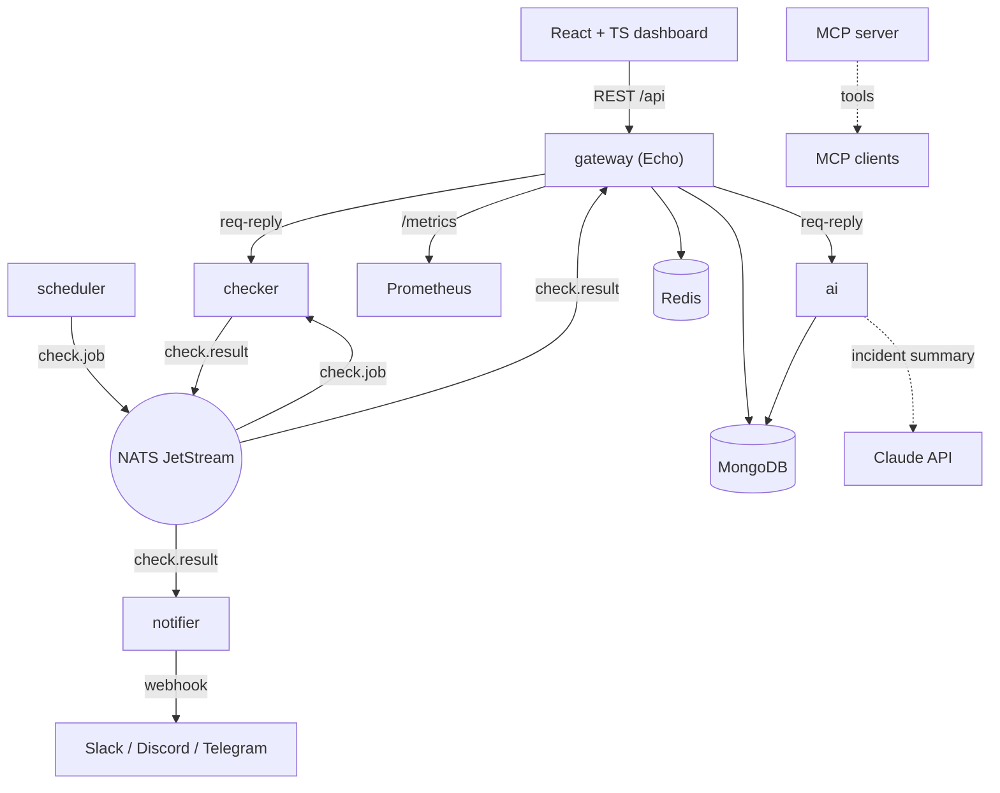

# Sitemon

Full-stack, event-driven **site health monitoring platform** — Go microservices,
a React/TypeScript dashboard, NATS, MongoDB, Redis, and Claude-powered incident
analysis, all runnable with one command.

Started as a CLI; grown into a distributed platform. The original `check`,
`ssl`, `request`, `dashboard`, and `schedule` commands still ship as `apps/cli`.

## Architecture



## Services

| Service | Role |
|---------|------|
| `gateway` | Echo REST + WebSocket entrypoint; routes to services, serves `/api/*`, `/metrics` |
| `checker` | Runs health/SSL/load checks; answers RPC and consumes `check.job` |
| `scheduler` | Emits `check.job` on a cron schedule |
| `notifier` | Consumes `check.result`, detects up↔down transitions, sends webhooks |
| `ai` | Anomaly analysis + Claude incident summaries (`ai.analyze` RPC) |
| `ai/mcp` | Stdio MCP server exposing `check_url`, `ssl_check`, `analyze` |
| `web` | React 19 + TypeScript dashboard (Vite) |
| `cli` | Original Cobra CLI |

Shared code lives in `packages/shared` (http, ssl, monitor, notify, scheduler,
loadtest, store, cache, bus, models, …).

## Quick start

```bash
cp .env.example .env
make up          # mongo + redis + nats + gateway + checker + scheduler + notifier + ai + web
```

- Dashboard: http://localhost:5173
- API: http://localhost:8080
- Metrics: http://localhost:8080/metrics
- Observability (Prometheus + Grafana): `make obs-up`

Build binaries or run the CLI without Docker:

```bash
make build                                  # ./bin/<service>
go run ./apps/cli check -u https://example.com
```

## API

| Method | Path | Description |
|--------|------|-------------|
| GET | `/health` | Liveness |
| GET | `/api/status` | Latest result per URL (Redis-backed) |
| GET | `/api/history?url=&limit=` | Stored check history (Mongo) |
| GET | `/api/stats?url=` | Uptime + latency aggregate |
| GET | `/api/analyze?url=` | AI incident analysis (anomalies + summary) |
| POST | `/api/checks` | Ad-hoc health check |
| GET | `/api/ssl?url=` | TLS certificate details |
| POST | `/api/loadtest` | HTTP load test |
| GET | `/metrics` | Prometheus exposition |

Full contract: `apps/gateway/openapi.yaml`.

## Event bus

NATS JetStream carries events; core NATS request-reply carries synchronous RPC.

| Subject | Producer | Consumer |
|---------|----------|----------|
| `check.job` | scheduler | checker |
| `check.result` | checker | gateway, notifier |
| `alert.raised` | notifier | audit |
| `checker.run` / `checker.loadtest` | gateway | checker (req-reply) |
| `ai.analyze` | gateway | ai (req-reply) |

## Tech stack

Go 1.27 · Echo · NATS JetStream · MongoDB · Redis · Anthropic Go SDK
(`claude-opus-5`) · MCP · React 19 · TypeScript · Vite · TanStack Query ·
Zustand · Recharts · Prometheus · Docker · GitHub Actions (GHCR) · Kubernetes.

## Deploy

- **Local dev:** `make up` (`infra/docker-compose.yml`)
- **Production:** `docker compose -f infra/docker-compose.prod.yml up -d`
  (GHCR images behind Caddy)
- **Kubernetes:** `kubectl apply -f infra/k8s/sitemon.yaml`
- **Images:** built and pushed to GHCR by `.github/workflows/images.yml`

## Development

```bash
make test-race   # go test -race ./...
make lint        # go vet + gofmt check
```

CI (`.github/workflows/ci.yml`) runs gofmt, vet, build, and race tests on every
push and PR.

## License

MIT
