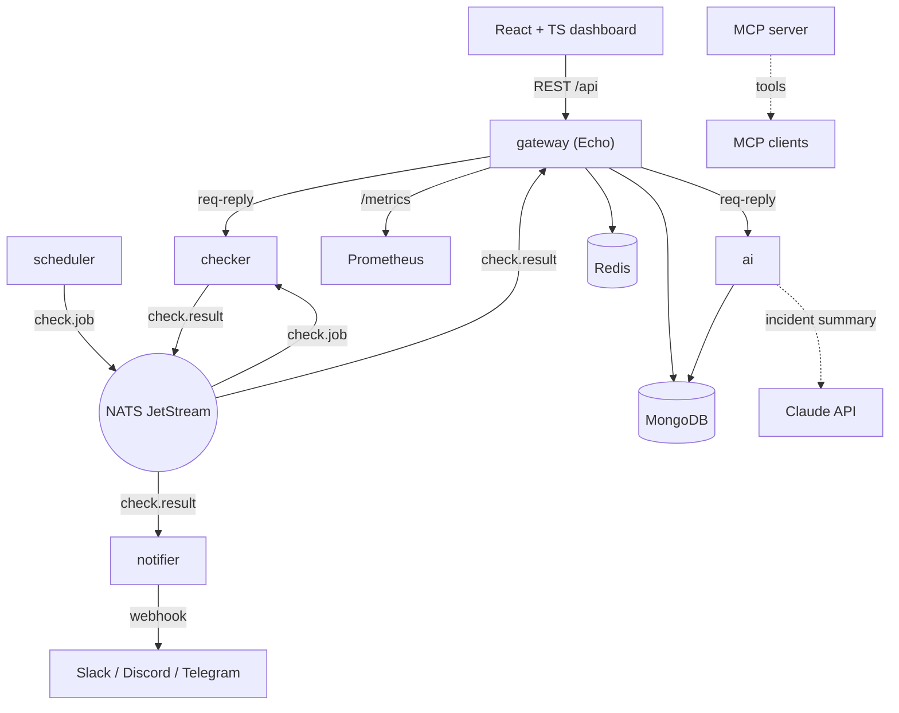

<div align="center">

# Sitemon — Developer Guide

**Watch your sites from one place — health checks and load tests that fan out across Go microservices over NATS, land in MongoDB and Redis, surface on a React dashboard, and turn into plain-English incident summaries written by Claude.**

[](https://go.dev/)
[](https://react.dev/)
[](https://nats.io/)
[](https://docs.anthropic.com/)
[](LICENSE)

</div>

## What it is

Uptime monitoring is rarely one process. A scheduler decides *when* to check, a
worker does the checking, something stores the history, something else decides an
alert is worth sending, and a person wants to see all of it on a screen. Sitemon
models that split as it really is: independent Go services that talk over a
message bus, each doing one job and surviving the others being restarted.

A `scheduler` emits check jobs on a cron cadence. A `checker` picks them up,
runs the HTTP or TLS check, and publishes the result. The `gateway` caches the
latest status for the dashboard and answers ad-hoc checks and load tests; the
`notifier` watches the same result stream and sends a webhook only when a site
actually crosses from up to down, or back. History accumulates in MongoDB, and
an `ai` service reads it back to compute anomalies and — when a key is present —
ask Claude for a two-sentence incident summary with a probable cause. The whole
thing still ships the original single-binary CLI, and the gateway still runs
standalone with no bus at all.

## Architecture



```
apps/
├── gateway/    Echo REST + WebSocket, /metrics — routes to services, serves /api/*
├── checker/    HTTP/SSL/load engine — answers RPC and consumes check.job
├── scheduler/  cron → check.job
├── notifier/   check.result → webhooks on up↔down transitions
├── ai/         anomaly analysis + Claude incident summaries (ai.analyze RPC)
│   └── mcp/    stdio MCP server: check_url, ssl_check, analyze
├── cli/        the original Cobra CLI (check, ssl, request, dashboard, schedule)
└── web/        Vite + React 19 + TypeScript dashboard

packages/shared/   http · ssl · monitor · notify · scheduler · loadtest
                   store (Mongo) · cache (Redis) · bus (NATS) · models
                   health · logger · config · validation · tui

infra/             docker-compose(.prod).yml · caddy · mongo · prometheus
                   grafana · k8s
```

Single Go module; each `apps/<service>/cmd` compiles to its own binary.

## Features

**Monitoring**
- Health checks with UP / WARNING / REDIRECT / DOWN status, response code and latency
- **SSL inspection** — issuer, validity window, days remaining, protocol
- **Load testing** — workers, RPS limit, duration or count, ramp-up, p50/p90/p95/p99
- **Watch and schedule** modes, cron-driven, with Cloudflare-bypass headers
- History in MongoDB; latest status and dedup state in Redis, shared across replicas

**Distributed by design**
- NATS **JetStream** events (`check.job`, `check.result`, `alert.raised`) and core
  **request-reply** RPC (`checker.run`, `checker.loadtest`, `ai.analyze`)
- Services fan out and load-balance on durable queue groups; any one can restart
- Gateway degrades to **in-process** mode when no bus is present — still works standalone

**AI**
- Statistical anomaly detection — latency spikes, elevated error rate, intermittent downtime
- **Claude incident summaries** via the Anthropic Go SDK (`claude-opus-5`), gated on
  `ANTHROPIC_API_KEY` and a clean no-op without one
- **MCP server** exposing `check_url`, `ssl_check`, and `analyze` to any MCP client

**Dashboard**
- React 19 + TypeScript, live status grid (TanStack Query), ad-hoc check form
- Per-URL stats tiles and a Recharts latency chart; theme-aware light/dark

**Alerts**
- Slack, Discord, Telegram, or a generic webhook — provider detected from the URL
- Fired only on a real transition, with recovery notices

**Operations**
- Prometheus metrics at `/metrics`; a Grafana profile in the dev stack
- Multi-stage Docker images published to GHCR; Kubernetes manifests; Caddy in prod

## Requirements

- Go 1.27+
- Docker (for the local stack: MongoDB, Redis, NATS)
- Node 24 + pnpm (only to develop the web app)
- An `ANTHROPIC_API_KEY` is optional — the AI service runs without one

## Installation

```bash
git clone https://github.com/mralaminahamed/sitemon.git
cd sitemon
cp .env.example .env
make up
```

`make up` brings up MongoDB, Redis, NATS and every service. Then:

- Dashboard — http://localhost:5173
- API — http://localhost:8080
- Metrics — http://localhost:8080/metrics
- Observability (Prometheus + Grafana) — `make obs-up`

Without Docker:

```bash
make build                                   # ./bin/<service>
go run ./apps/cli check -u https://example.com
```

## Development

```bash
make build         # build every service binary
make test          # go test ./...
make test-race     # go test -race ./...
make lint          # go vet + gofmt check
make obs-up        # prometheus + grafana
make logs s=gateway
```

Full gate before committing:

```bash
gofmt -l apps packages && go vet ./... && go build ./... && CGO_ENABLED=1 go test -race ./...
```

CI (`.github/workflows/ci.yml`) runs the same gate on every push and PR;
`.github/workflows/images.yml` builds and pushes service images to GHCR on
`trunk` and version tags.

### API

Namespace `/api`. Full contract in [`apps/gateway/openapi.yaml`](apps/gateway/openapi.yaml).

| Method | Route | Purpose |
|--------|-------|---------|
| GET | `/health` | Liveness |
| GET | `/api/status` | Latest result per URL *(Redis)* |
| GET | `/api/history?url=&limit=` | Stored history *(Mongo)* |
| GET | `/api/stats?url=` | Uptime + latency aggregate |
| GET | `/api/analyze?url=` | AI incident analysis — anomalies and summary |
| POST | `/api/checks` | Ad-hoc health check |
| GET | `/api/ssl?url=` | TLS certificate details |
| POST | `/api/loadtest` | HTTP load test |
| GET | `/metrics` | Prometheus exposition |

### Event bus

| Subject | Producer | Consumer |
|---------|----------|----------|
| `check.job` | scheduler | checker |
| `check.result` | checker | gateway, notifier |
| `alert.raised` | notifier | audit |
| `checker.run` · `checker.loadtest` | gateway | checker *(req-reply)* |
| `ai.analyze` | gateway | ai *(req-reply)* |

## Deploy

- **Local dev** — `make up` (`infra/docker-compose.yml`)
- **Production** — `docker compose -f infra/docker-compose.prod.yml up -d` (GHCR images behind Caddy)
- **Kubernetes** — `kubectl apply -f infra/k8s/sitemon.yaml`

## Contributing

Branch from `trunk`, keep the full gate green, and open a pull request.

Commits follow [Conventional Commits](https://www.conventionalcommits.org/):

```
type(scope): description
```

Types `feat` `fix` `docs` `refactor` `perf` `test` `build` `ci` `chore` ·
scopes `gateway` `checker` `scheduler` `notifier` `ai` `web` `cli` `infra`.

Merge with a merge commit (not squash) so scoped commits stay in history.
Conventions in full: [`AGENTS.md`](AGENTS.md).

## License

MIT — see [LICENSE](LICENSE).
